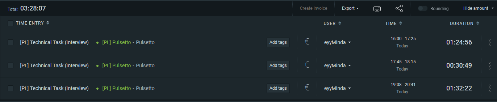

# pulsetto job task

This repository contains a frontend job task completed for Pulsetto.

- Objective: Recreate six specific Figma-designed sections using CodePen.
- Focus: We are looking for clean, reusable code and high-fidelity translation from design to browser.
- Active Work: The task is designed to take between 4–6 hours. If you find yourself spending significantly more or less time, please include a brief note explaining your reasoning.

## figma source

The task is based on the Pulsetto Figma provided here:

- [Pulsetto Figma task](https://www.figma.com/design/ZzkQrsV9BaUSFzvt0OAWFa/Pulsetto-testine-uzduotis?node-id=0-1&p=f&t=JLR7sjI9LSJE8Bpp-0)

## deployed preview

- [https://eyyminda.github.io/Pulsetto-Task/](https://eyyminda.github.io/Pulsetto-Task/)

## time spent

